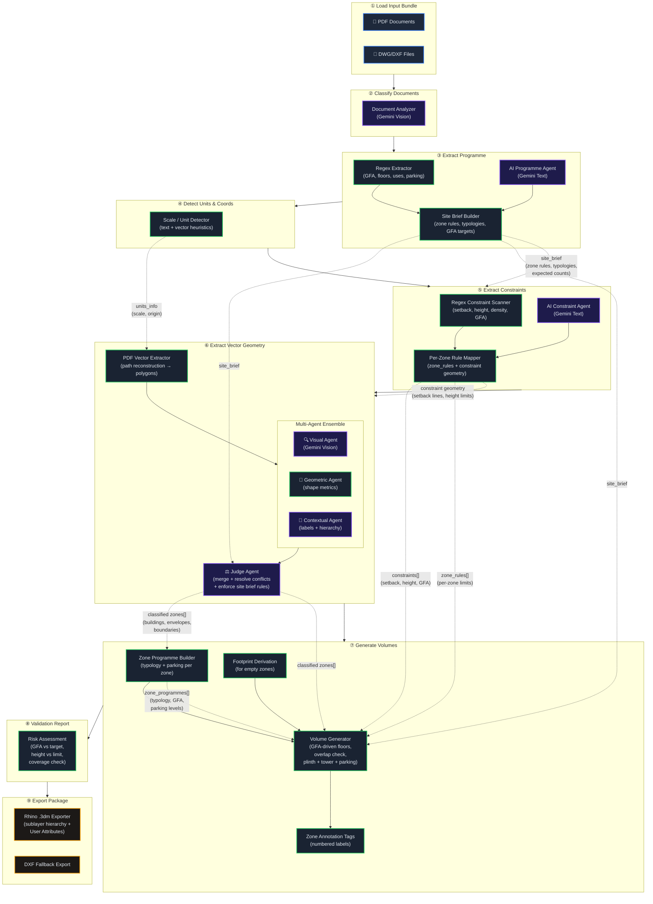

# SpatialBrief

An AI-powered application for extracting constraints, rules, and semantic elements from regulatory documents and vector geometries to generate structured, Rhino/Grasshopper-ready design inputs.

SpatialBrief transforms zoning PDFs and CAD drawings into a structured analytical pipeline — automatically identifying plot boundaries, building footprints, zones, regulatory constraints, building programmes, and 3D volume models.

## Requirements

- **Python** 3.10+
- **Node.js** 18+

### Quick Install

```bash
# Windows
install.bat

# macOS / Linux
chmod +x install.sh && ./install.sh
```

Or install manually:

```bash
# Backend
cd backend
python -m venv venv
venv\Scripts\activate        # Windows
# source venv/bin/activate   # macOS/Linux
pip install -r requirements.txt

# Frontend (from project root, not from backend/)
cd ..\frontend               # Windows
# cd ../frontend             # macOS/Linux
npm install
```

> [!TIP]
> On Windows you may need to run `Set-ExecutionPolicy -Scope CurrentUser RemoteSigned` in PowerShell before activating the virtual environment.

### Python Dependencies

Core packages (installed via `requirements.txt`):

| Package | Purpose |
|---------|---------|
| **fastapi** + **uvicorn** | Backend API server |
| **pydantic** + **pydantic-settings** | Data validation, schemas, and `.env` config |
| **python-multipart** | File upload handling (required by FastAPI) |
| **PyMuPDF** (`fitz`) | PDF rendering, path reconstruction, and text extraction |
| **shapely** | Geometric analysis, polygon assembly, and spatial operations |
| **ezdxf** | DXF/CAD file parsing and fallback export |
| **google-genai** | Google Gemini API (unified SDK) for AI vision classification and constraint extraction |
| **openai** | OpenAI-compatible API client (optional provider) |
| **rhino3dm** | Native .3dm export with sublayer hierarchy and Rhino User Attributes (requires Python ≤ 3.13) |

### Vector Conversion Dependency

> [!IMPORTANT]
> This application relies on the **ODA File Converter** for parsing and converting native DWG files into the DXF format required for processing.
>
> You must have the ODA File Converter installed locally on your system for DWG ingestion to work.
> 
> Download it here: [ODA File Converter](https://www.opendesign.com/guestfiles/oda_file_converter)

### API Key Configuration

> [!NOTE]
> This application uses **Gemini Vision AI** for intelligent classification of extracted geometry, regulatory constraint extraction, building programme analysis, and zone validation. The AI features are **optional** — the app falls back to rule-based processing if no API key is provided.

To enable AI-powered features:
1. Navigate to the **Settings Panel** in the app's top ribbon (⚙ icon)
2. Enter your **Gemini API Key** (get one at [Google AI Studio](https://aistudio.google.com/apikey))
3. Select a model (e.g., `gemini-2.5-flash`) and configure per-agent model overrides if desired
4. Click **Save Settings**

The API key is stored locally in your browser's `localStorage` and is sent to the backend via a secure header — it is **never stored on the server or committed to code**.

Alternatively, you can create a `.env` file in `backend/`:
```env
GEMINI_API_KEY="your-gemini-key"
```

## Running the Application

### Quick Start

```bash
# Windows
run.bat

# macOS / Linux
chmod +x run.sh && ./run.sh
```

### Manual Start

**Backend:**
```bash
cd backend
venv\Scripts\activate        # Windows
# source venv/bin/activate   # macOS/Linux
uvicorn app.main:app --host 0.0.0.0 --port 8200 --reload
```

**Frontend** (in a separate terminal):
```bash
cd frontend
npm run dev
```

The app will be available at `http://localhost:5173/`.  
The backend API runs at `http://localhost:8200/`.

## Architecture

### 9-Node Analytical Pipeline

SpatialBrief processes documents through a 9-node pipeline:

| # | Node | Description |
|---|------|-------------|
| 1 | **Load Input Bundle** | Upload PDF, DWG, and DXF documents |
| 2 | **Classify Documents** | Determine file roles (zoning map vs. regulatory text) via AI |
| 3 | **Extract Programme** | Programme, GFA targets, building metadata — formulates tasks for vector extraction via site brief |
| 4 | **Detect Units & Coordinates** | Detect drawing scale, units and coordinate origin |
| 5 | **Extract Constraints** | AI-powered setback, height, density, GFA & parking rule extraction with per-zone constraint mapping |
| 6 | **Extract Vector Geometry** | Multi-agent ensemble extraction of zones, buildings and boundaries (uses constraints as context) |
| 7 | **Generate Volumes** | Floor-by-floor 3D massing with plinths and underground parking |
| 8 | **Validation Report** | Summary and cross-validation of all pipeline outputs |
| 9 | **Export Package** | Rhino .3dm export with sublayer hierarchy and User Attributes (DXF fallback) |

### Multi-Agent Pipeline & Data Flow



### Data Objects Passed Between Nodes

| Data Object | Created By | Consumed By | Contents |
|---|---|---|---|
| `site_brief` | Node 3 (Programme) | Nodes 5, 6, 7 | Zone rules, expected counts, typologies, GFA targets |
| `text_blocks[]` | Node 3 (Programme) | Nodes 5, 6 | Extracted text segments from documents |
| `units_info` | Node 4 (Units) | Node 6 | Drawing scale, coordinate origin, unit system |
| `constraints[]` | Node 5 (Constraints) | Node 7 | Setback, height, density, GFA rules per zone |
| `zone_rules[]` | Node 5 (Constraints) | Node 7 | Per-zone constraint overrides |
| `constraint_geometry` | Node 5 → 6 | Viewport | Setback lines, height limit volumes as geometry |
| `zones[]` (classified) | Node 6 (Vectors) | Node 7 | Buildings, envelopes, boundaries with Shapely polys |
| `zone_programmes[]` | Node 7 (Programme) | Node 7 (Volumes) | Per-zone typology, target GFA, parking levels |
| `volumes[]` | Node 7 (Volumes) | Viewport + Node 9 | Floor-by-floor 3D geometry with sublayer hierarchy |
| `annotations[]` | Node 7 (Volumes) | Viewport | Numbered zone labels at centroids |

### Multi-Agent Ensemble Extraction (Node 6)

The vector geometry extraction uses a **multi-agent ensemble** architecture:

1. **Site Brief (Node 3)** — Pre-analysis of text, metadata, and regulatory context produces binding rules: expected zone count, building count, typologies, GFA targets, and special rules.
2. **Three Specialist Agents** run concurrently via `ThreadPoolExecutor`:
   - **Visual Agent** — Analyses rendered page images + annotated overlays with Gemini Vision
   - **Geometric Agent** — Classifies polygons by shape metrics, area ratios, and compactness
   - **Contextual Agent** — Uses text labels, containment hierarchy, and spatial relationships
3. **Judge Agent** — Merges results, resolves conflicts, enforces the binding rules from the site brief, and resolves nested building/plinth collisions.

### AI Agent Modules

| Module | Purpose |
|--------|---------|
| `ensemble_classifier` | Multi-agent concurrent classification (Visual + Geometric + Contextual + Judge) |
| `site_brief_analyzer` | Pre-analysis: regex + AI extraction of GFA, zones, typologies → binding rules |
| `pipeline_stages` | Node 3 (Extract Programme) and Node 4 (Detect Units) stage orchestration |
| `ai_vision_classifier` | Single-pass Gemini Vision classification (used within the ensemble's Visual Agent) |
| `constraint_extractor` | Regex + AI extraction of regulatory constraints with per-zone rule mapping and setback/height geometry |
| `programme_extractor` | Building programme extraction (GFA, uses, floors) with AI gap-fill from constraints |
| `volume_generator` | GFA-driven floor-by-floor 3D volume extrusion with overlap prevention and per-zone constraints |
| `rhino_exporter` | .3dm export with sublayer hierarchy (`Parent::Child`) and Rhino User Attributes per object |

### Project Structure

```
SpatialBrief/
├── backend/
│   ├── app/
│   │   ├── main.py                           # FastAPI app entry point
│   │   ├── config.py                         # Pydantic settings (.env loader)
│   │   ├── routers/
│   │   │   ├── upload.py                     # /upload and /process endpoints (pipeline orchestration)
│   │   │   └── export.py                     # /export/rhino endpoint (.3dm / .dxf)
│   │   ├── ai_agents/                        # AI-powered analysis modules
│   │   │   ├── constraint_extractor.py       # Regex + AI constraint extraction + geometry
│   │   │   ├── programme_extractor.py        # GFA / uses / floors extraction with AI fill
│   │   │   ├── volume_generator.py           # 3D floor-by-floor massing
│   │   │   ├── rhino_exporter.py             # .3dm / .dxf export with sublayers + UserStrings
│   │   │   └── ai_zone_validator.py          # Post-extraction AI zone validation
│   │   ├── vector_ingestion/                 # Geometry extraction pipeline
│   │   │   ├── pdf_vector_extractor.py       # 6-stage PDF path → polygon pipeline (Node 6)
│   │   │   ├── ensemble_classifier.py        # Multi-agent ensemble (3 specialists + judge)
│   │   │   ├── site_brief_analyzer.py        # Site brief generation (regex + AI)
│   │   │   ├── pipeline_stages.py            # Node 3 + Node 4 stage functions
│   │   │   ├── ai_vision_classifier.py       # Gemini Vision image classification
│   │   │   ├── hierarchy_builder.py          # Adaptive subzone extraction
│   │   │   ├── cad_extractor.py              # DWG/DXF ingestion via ezdxf
│   │   │   └── zone_classifier.py            # Rule-based zone type classifier
│   │   ├── schemas/                          # Pydantic data models
│   │   └── semantic_mapping/                 # Semantic layer analysis
│   ├── requirements.txt
│   └── uploads/                              # Uploaded files (gitignored)
├── frontend/
│   ├── src/
│   │   ├── App.tsx                           # Main application layout + state
│   │   ├── ErrorBoundary.tsx                 # React error boundary
│   │   ├── components/
│   │   │   ├── layout/TopRibbon.tsx          # App header with project controls
│   │   │   ├── workflow/NodeGraph.tsx         # 9-node pipeline sidebar
│   │   │   ├── viewer/ThreeSceneManager.tsx   # 3D viewport (Three.js / R3F)
│   │   │   ├── settings/                     # ApiSettingsPanel + ExtractionSettingsPanel
│   │   │   └── vectorReview/                 # Geometry review & layer toggle tools
│   │   ├── index.css                         # Design system & global styles
│   │   └── App.css                           # Component styles
│   ├── package.json
│   └── index.html
├── install.bat / install.sh                  # One-command installation
├── run.bat / run.sh                          # One-command startup
├── .gitignore
├── LICENSE
└── README.md
```

### Tech Stack

| Layer | Technology |
|-------|-----------|
| Frontend | React 19 + TypeScript + Vite |
| 3D Viewport | Three.js + React Three Fiber + Drei |
| Backend | FastAPI + Uvicorn (Python) |
| AI | Google Gemini (vision + text) via `google-genai` SDK |
| Geometry | Shapely + PyMuPDF + ezdxf |
| Export | ezdxf (DXF fallback) + rhino3dm (.3dm with sublayers & User Attributes) |
| Styling | Vanilla CSS with dark-mode design system |

## License

See [LICENSE](LICENSE) for details.
